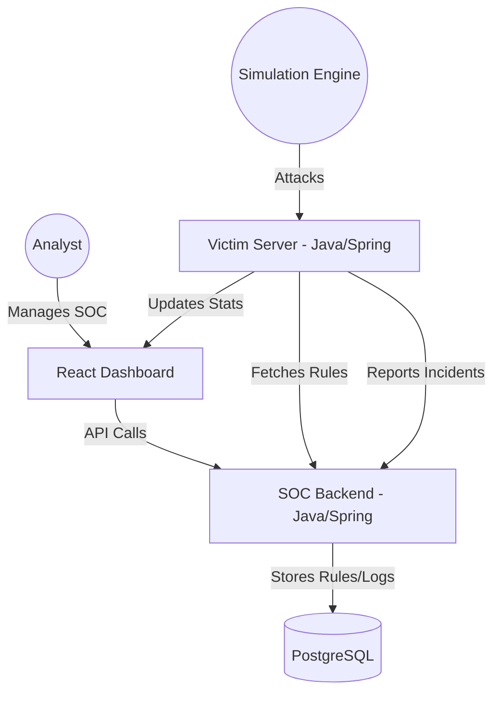

# 🛡️ Fraud Simulation & SOC Monitoring System

[](https://www.docker.com/)
[](https://spring.io/projects/spring-boot)
[](https://reactjs.org/)
[](https://www.postgresql.org/)

A comprehensive end-to-end **Fraud Detection and Cyber Defense Simulation** platform. This project simulates a real-world scenario where a Security Operations Center (SOC) monitors, detects, and mitigates various cyber attacks against a target application.

---

## 🚀 Key Features

### 📡 Real-Time Monitoring
- **Live Attack Feed**: View incoming requests and security events as they happen.
- **Dynamic Risk Scoring**: Every request is analyzed and assigned a score based on malicious patterns.
- **Interactive Dashboard**: Visual graphs and statistics showing traffic trends and blocked threats.

### ⚔️ Attack Simulation Engine
- **Brute Force**: Simulate aggressive credential guessing attacks with configurable RPS.
- **SQL Injection**: Test database protection with malicious payload injections.
- **XSS & Tampering**: Validate input sanitization and parameter integrity.
- **Custom Scenarios**: Build and save your own attack patterns to test specific defense rules.

### 🛡️ Active Defense System
- **Rules Engine**: Create and manage security rules (Thresholds, Time Windows, Actions) dynamically.
- **Automatic Blocking**: Instant IP blocking when a threat exceeds the defined risk threshold.
- **Manual Control**: Directly manage the blacklist and unblock IPs from the dashboard.

---

## 🏗️ Architecture

The system is built using a **Multi-Tier Microservices Architecture**, fully containerized for seamless deployment.



---

## 🛠️ Technology Stack

| Component | Technology |
| :--- | :--- |
| **Frontend** | React 18, TypeScript, Material UI, Recharts |
| **SOC Backend** | Java 17, Spring Boot, Spring Security (JWT), Hibernate |
| **Victim Server** | Java 17, Spring Boot, Active Defense Logic |
| **Database** | PostgreSQL 16 |
| **Infrastructure** | Docker, Docker Compose, Nginx |

---

## 🚦 Getting Started

### Prerequisites
- [Docker Desktop](https://www.docker.com/products/docker-desktop/) installed and running.

### Installation & Run
1. **Clone the repository**:
   ```bash
   git clone https://github.com/seanpip05/fraud-project.git
   cd fraud-project
   ```

2. **Configure Environment**:
   The system uses a `.env` file for secrets. Ensure you have one in the root directory:
   ```env
   DB_PASSWORD=your_secure_password
   JWT_SECRET_KEY=your_base64_secret_key
   JWT_EXPIRATION=86400000
   ```

3. **Launch the platform**:
   ```bash
   docker compose up --build
   ```

4. **Access the Dashboard**:
   Open your browser and navigate to `http://localhost`.

---

## 📸 Dashboard Preview

*Insert your beautiful screenshots here!*
- **Main SOC View**: Monitoring global security status.
- **Victim Monitor**: Real-time traffic analysis.
- **Rule Builder**: Configuring the defense logic.

---

## 📜 Project Background
This project was developed as a final thesis/capstone to demonstrate the integration of modern web technologies with cybersecurity defense principles. It provides a safe environment to learn how automated detection systems (IDS/IPS) operate in high-pressure scenarios.

---

**Developed with ❤️ by Sean Pipkin**
